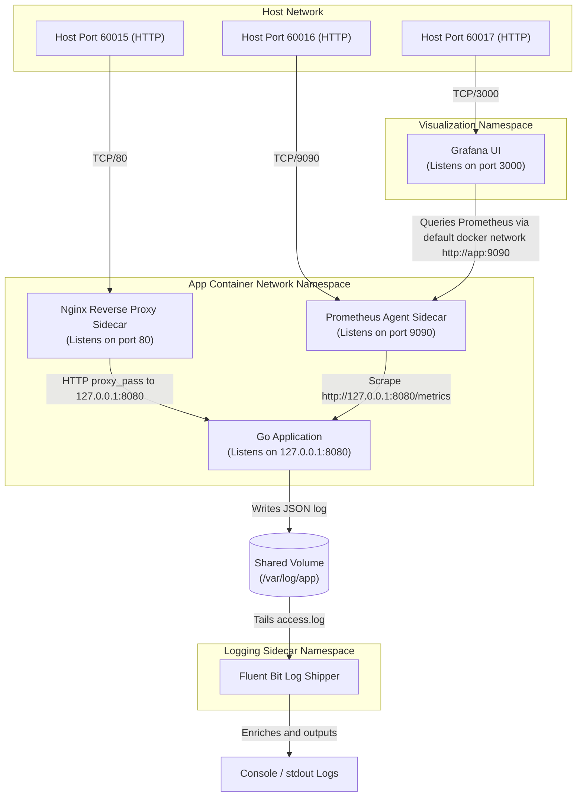

# Docker Sidecar Architecture

This document describes the architectural layout, communication paths, and container configurations for the Docker Sidecar Observability Example.

## Deployment Diagram

## Key Architectural Patterns

### 1. Shared Network Namespace (`network_mode: "service:app"`)
In standard Docker deployments, every container receives its own network interface (typically with an IP like `172.18.0.x`). 
In this sidecar implementation:
- The **Go Application** (`app`) acts as the parent network container.
- The **Nginx Proxy** and **Prometheus Scraper** are configured with `network_mode: "service:app"`. 
- This forces both sidecars to join the `app` container's network namespace, meaning they share the same network interfaces, routing tables, and IP addresses.
- **Consequences**:
  1. The sidecars can communicate with the main Go application via `127.0.0.1` (localhost).
  2. The application's ports do not need to be exposed to the outside docker network (it binds solely to `127.0.0.1:8080`).
  3. External ports (`60015` and `60016`) are declared on the parent container (`app`) but are actually bound by Nginx (port 80) and Prometheus (port 9090) within that shared stack.

### 2. Shared File System Volume
For logging:
- The Go Application writes structured JSON logs to a directory `/var/log/app/` inside its container.
- A Docker named volume `shared-logs` is mounted at `/var/log/app` in both the `app` container and the `logging-sidecar` container.
- The **Fluent Bit** sidecar tails this directory, reads new line additions, parses the JSON payload, enriches each log entry with custom metadata (`sidecar_name: fluent-bit`), and streams it to standard output.
